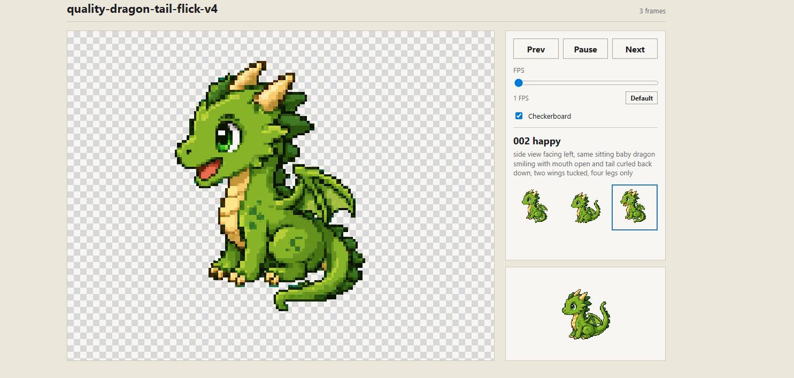

# anim8gen

Generate short game sprite animations with an agent skill.

`anim8gen` turns prompts like “a cat pounces,” “a knight swings a sword,” or
“a pirate ship fights a kraken” into reviewable animation packages: generated
frames, aligned sprites or scenes, contact sheets, and an interactive HTML
preview.

It is designed for compact game loops and actions, not long-form video.

## See It

Click the preview to open the interactive playback page.

<p>
  <a href="https://zeveck.github.io/anim8gen/demos/pirate-ship-kraken-cannon/">
    
  </a>
</p>

anim8gen can produce tiny transparent sprites, character actions, and wider
scene loops:

- Scene animation: [Pirate Ship Kraken](https://zeveck.github.io/anim8gen/demos/pirate-ship-kraken-cannon/), [Space Station Explosion](https://zeveck.github.io/anim8gen/demos/sci-fi-space-station-explosion/)
- Character action: [Knight Sword Spark](https://zeveck.github.io/anim8gen/demos/quality-knight-sword-spark-v4/), [Cat Pounce](https://zeveck.github.io/anim8gen/demos/quality-cat-pounce-v2/)
- Small loops: [Cat Tail Swish](https://zeveck.github.io/anim8gen/demos/quality-cat-tail-swish-v4/), [Dragon Tail Flick](https://zeveck.github.io/anim8gen/demos/quality-dragon-tail-flick-v4/)

Full gallery: https://zeveck.github.io/anim8gen/

## Install

Ask your agent to install both skills:

```text
Install the anim8gen skill from github.com/zeveck/anim8gen.
anim8gen requires imagegen2, so also install the imagegen2 skill from
github.com/zeveck/imagegen2. After installing both, reload or restart the
agent so the skills are available.
```

`anim8gen` requires [`imagegen2`](https://github.com/zeveck/imagegen2) for
image generation.

## Configure

Configure `imagegen2` with an OpenAI API key. A typical setup is a project
`.env` file:

```text
OPENAI_API_KEY=sk-proj-your-key-here
```

`imagegen2` loads `.env` itself and reports missing or invalid credentials.

## Use

Ask your agent for a compact sprite animation:

```text
Use anim8gen to make a 4-frame 16-bit pixel art treasure chest that opens,
shines, and returns to idle.
```

Ask for a GIF directly by adding `gif`:

```text
Use anim8gen gif to make a cute cat tail swish loop, front view, 3 frames.
```

`showit` and `noshow` can be included with `gif`:

```text
Use anim8gen gif showit to make a side-view knight sword slash with a spark.
```

More examples:

```text
Use anim8gen to make a wide 10-frame pixel art pirate ship attacked by a
kraken, with the ship firing a cannon and the kraken retreating.
```

```text
Use anim8gen to make a cute cat tail swish loop, front view, 3 frames.
```

```text
Use anim8gen to make a side-view knight sword slash with a spark at the end.
```

```text
Use anim8gen to make a small slime hop loop, front view, 4 frames.
```

<p>
  <a href="https://zeveck.github.io/anim8gen/demos/quality-cat-pounce-v2/">
    
  </a>
</p>

<p>
  <a href="https://zeveck.github.io/anim8gen/demos/quality-dragon-tail-flick-v4/">
    
  </a>
</p>

Details that help:

- subject and action
- style, such as `16-bit RPG pixel art`
- camera view, such as front, side, or isometric
- frame count, if important
- any reference image or sprite sheet to preserve identity

## Good Fits

- idle loops
- blinks, hops, pounces, emotes
- small object animations
- quick attacks and casts
- quick game asset exploration

Not a good fit for long cinematic animation, full directional sprite packs,
complex multi-character scenes, or production animation authoring.

## What Gets Produced

Each run creates a reviewable package with:

- raw generated candidates
- accepted aligned sprite frames
- a contact sheet
- visual review notes
- validation output
- an HTML preview page
- an animated GIF when the request includes `gif`

## Development

Maintainer notes live in [anim8gen/DEV_README.md](anim8gen/DEV_README.md).

Public demos are exported into `public/`:

```bash
python3 anim8gen/tools/export_public_demo.py <animation-id> [<animation-id> ...] --clean
```
